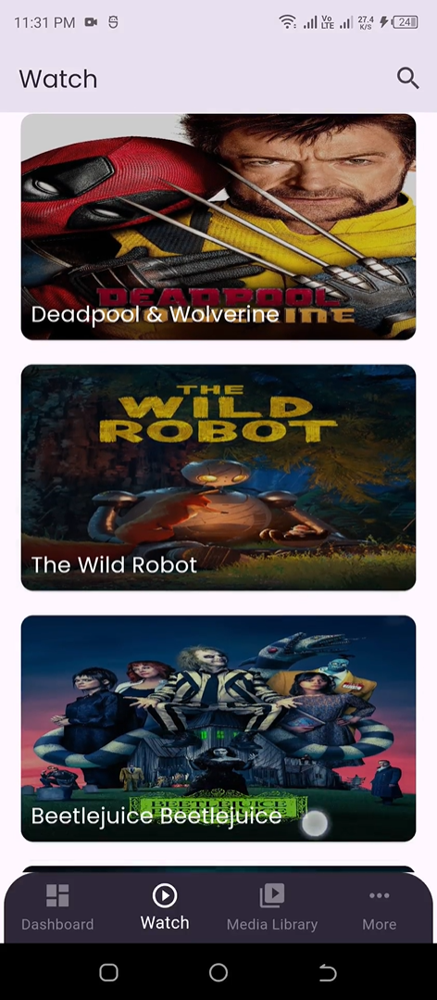
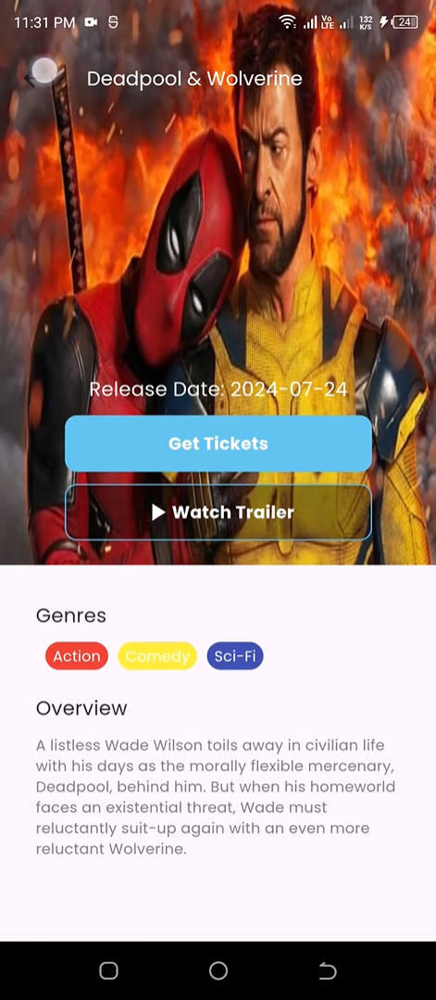
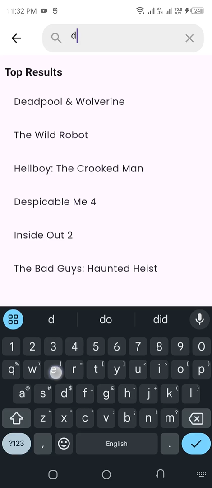

## 🎬 CineHub - Movie Discovery App (Clean Architecture)
**Developed during Bytewise Ltd. Fellowship**

[](https://flutter.dev)
[](https://www.themoviedb.org/documentation/api)
[](https://blog.cleancoder.com/uncle-bob/2012/08/13/the-clean-architecture.html)

## 📱 Overview
A feature-rich Flutter app that showcases movies with:
- 🎥 Trending/Popular/Upcoming movies by category
- 🔍 Movie search functionality
- 🏷️ Detailed movie info (description, genres, ratings)
- 🖼️ High-quality posters and backdrops

## 📽 Demo
[Demo Video (Google Drive)](https://drive.google.com/file/d/1hnCWBtZm9z1Jk8KkNJSsOj2DQ7u0NoGu/view?usp=drive_link)

## 🏗️ Architecture Overview

```
lib/
├── utils/       # Extensions, helpers
├── viewmodels/  # Business logic and state management
├── views/       # UI pages
├── widgets/     # Reusable UI components
└── main.dart    # App entry point
```

**Explanation of the Architecture:**

* **utils:** Contains utility functions and extensions.
* **viewmodels:** Handles the app's business logic and manages the state that is displayed in the UI.
* **views:** Contains the UI pages (e.g., Home Screen, Details Screen).
* **widgets:** Contains reusable UI components.
* **main.dart**: the entry point of the application

## 🛠️ Tech Stack

| Layer | Technologies Used |
| :---------------- | :-------------------------------------------------------------------------------------------------------------------------- |
| Core | Dart |
| Networking | http ^1.2.2 |
| UI | Flutter |
| State Management | provider: ^6.1.2 |
| Image Caching | cached_network_image: ^3.4.0 |
| Other | cupertino_icons: ^1.0.6 |

## ✨ Key Features

-   Movie data display
-   Responsive UI with shimmer loading effects
-   Genre-based categorization
-   Movie Search
-   Detailed Movie View

## 🖼️ Screenshots

| Home Screen | Movie Details | Search |
| :---------- | :------------ | :------- |
|  |  |  |

## 🚀 Setup

1.  Install dependencies:

    ```bash
    flutter pub get
    ```
2.  Run the app:

    ```bash
    flutter run
    ```

## 🔗 Resources
  * **Flutter Documentation:** [https://flutter.dev/docs](https://flutter.dev/docs) -  Add the link to the official Flutter documentation, as it's the primary resource for Flutter development.
  * **Cached Network Image:** [https://pub.dev/packages/cached_network_image](https://pub.dev/packages/cached_network_image) - Link to the Pub.dev page for the Cached Network Image package.
  * **HTTP Package:** [https://pub.dev/packages/http](https://pub.dev/packages/http) - Link to the Pub.dev page for the HTTP package.

## 🏆 Fellowship Highlights

* Implemented during Bytewise Ltd. Fellowship
* Code reviewed by senior developers
